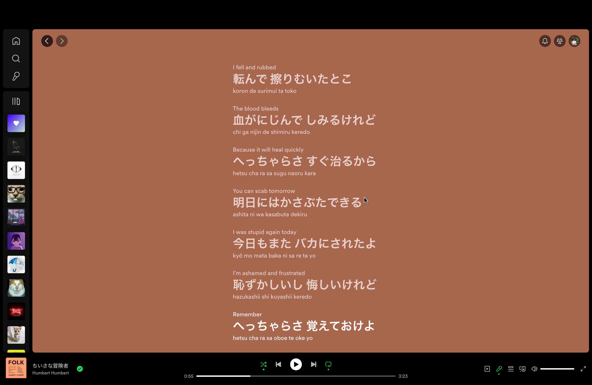
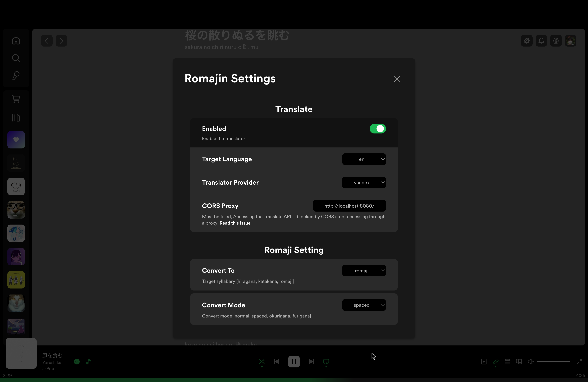
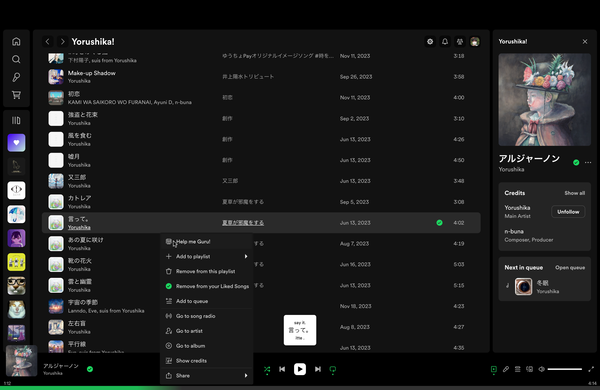

# Romajin

Romajin is an extension that serves as your guru within Spotify, offering both a Romaji converter and translator functionalities.

## Features
- [x] Japanese Lyrics Converter
- [x] Japanese Translator
- [x] Extension Settings
- [x] Japanese Context Converter
- [x] Change Translator Provider Settings

## Screenshoots




## Install Via Marketplace
1. Follow [Spicetify Marketplace](https://github.com/spicetify/spicetify-marketplace) readme and install it.
2. Open Spotify App -> Marketplace -> Extensions
3. Search ```Romajin``` Click Install Buttton. Done!

## Install Manually:
1. Copy [romajin.js](./romajin.js) into your Spicetify extensions directory. To see the the path of your Spicetify directory run this ```spicetify config-dir```
2. After putting [romajin.js](./romajin.js) into your Spicetify extension, run this command:
```
spicetify config extensions romajin.js
spicetify apply
```

## Contributions:
Contributions to Romajin are welcome! Feel free to submit bug reports, feature requests, or pull requests to help improve Romajin and enhance its functionality.
